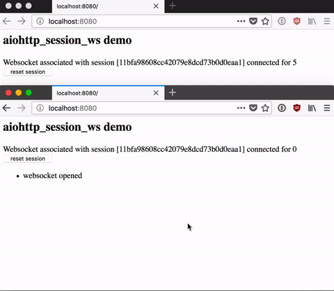

====================
`aiohttp_session_ws`
====================

.. image:: https://travis-ci.org/dfee/aiohttp_session_ws.svg?branch=master
    :target: https://travis-ci.org/dfee/aiohttp_session_ws
.. image:: https://coveralls.io/repos/github/dfee/aiohttp_session_ws/badge.svg?branch=master
    :target: https://coveralls.io/github/dfee/aiohttp_session_ws?branch=master

Simply put: associate your websockets with a user's session, and close those connections when you see fit.

For example, let's say you're using `aiohttp_security <https://pypi.org/project/aiohttp_security/>`_ and a user chooses to log in or log out.
Using ``aiohttp_session_ws`` you can disconnect the open websocket subscriptions associated with their session, and force them to re-connect and re-authorize thier websocket subscriptions.

Basic Example
-------------

The pieces of code in this example are taken from the ``demo`` directory of this repository.

.. code-block:: python

    async def handle_root(request):
        return web.Response(text='Hello world', content_type="text/html")

    async def handle_reset(request):
        session_ws_id = await get_session_ws_id(request)
        response = web.Response(
            text=f"Reset called on session {session_ws_id}!",
            content_type="text/plain",
        )
        await schedule_close_all_session_ws(request, response)
        await new_session_ws_id(request)
        return response

    async def handle_websocket(request):
        async with session_ws(request) as wsr:
            connected_at = datetime.now()
            session_ws_id = await get_session_ws_id(request)
            while True:
                await wsr.send_str(
                    f"Websocket associated with session [{session_ws_id}] "
                    f"connected for {(datetime.now() - connected_at).seconds}"
                )
                await asyncio.sleep(1)
            return wsr

    def make_app():
        app = web.Application(
            middlewares=[
                aiohttp_session.session_middleware(
                    aiohttp_session.SimpleCookieStorage()
                ),
                session_ws_middleware,
            ]
        )
        app.router.add_get("/", handle_root)
        app.router.add_get("/reset", handle_reset)
        app.router.add_get("/ws", handle_websocket)

        setup_session_websockets(app, SessionWSRegistry())
        return app

Use the code from the ``demo`` folder, which includes a simple template to interact with the websocket in your web-browser.

Narrative API
-------------

This package is designed to be straightforward and easy to use.
This lightweight documentation doesn't attempt to replace the need to read the code, so you're encouraged to go do exactly that.

There are a few moving pieces, but if (and when) you need to do something more complex, you can subclass away.

``SessionWSRegistry``
~~~~~~~~~~~~~~~~~~~~~
This is the core of ``aiohttp_session_ws``.

It's construction is noteworthy:

``SessionWSRegistry(self, *, id_factory, session_key)``

``id_factory`` generates a session-wide id that associates the websockets.
The default id_factory returns a UUID4, but you can supply your own callable (async callables are supported, too).
the function signature of ``id_factory`` is:

``id_factory(request: aiohttp.web.Request) -> typing.Hashable``

So pretty much, return something that can be the key in a dictionary (strings, integers, etc.).

``session_key`` is the name of the key in the session that maps to the session-wide websocket identifier.
By default it's a sensible ``aiohttp_session_ws_id``.

Helpers
~~~~~~~

You won't need to interact with ``SessionWSRegistry`` directly after you've created it, but know that it's available in your ``aiohttp.web.Application`` (access it like this: ``app['aiohttp_session_ws_registry']``).

The friendly global manipulators of this object are:

- ``get_session_ws_id(request)``
- ``new_session_ws_id(request)``
- ``delete_session_ws_id(request)``
- ``ensure_session_ws_id(request)``
- ``schedule_close_all_session_ws(request, response)``

These methods are importable directly from ``aiohttp_session_ws``.

Notice that ``schedule_close_all_session_ws`` takes a response object.
This allows us to end the ``keep-alive`` status of the response (via ``aiohttp.web.Response.force_close``).
This means that as soon as your user has finished receiveing the response, their outstanding websockets will close.

This also means that if you have users with re-connecting websockets, you should probably follow this pattern:

.. code-block:: python

    async def handle_logout(request):
        response = web.HTTPFound('/')
        await schedule_close_all_session_ws(request, response)
        await aiohttp_session.new_session(request)
        await new_session_ws_id(request)
        return response

session_ws
~~~~~~~~~~

To track the websockets, you'll use the async context manager ``session_ws``.
This context manager upgrades the request, and provides its ``aiothttp.web.WebSocketResponse`` counterpart.
Use if like this:

.. code-block:: python

    async def handle_websocket(request):
        async with session_ws(request) as wsr:
            async for msg in wsr:
                await wsr.send_str(f'Heard: {ws.data}')
            return wsr

That's it. Pretty simple, right?
If you'd like to provide the ``aiohttp.web.WebSocketResponse`` with initialization options (for example, the supported websocket protocols), pass those along to ``session_ws`` as named arguments.

.. code-block:: python

    async def handle_websocket(request):
        async with session_ws(request, protocols=('graphql-ws',)) as wsr:
            async for msg in wsr:
                await wsr.send_str(f'Heard: {ws.data}')
            return wsr

As mentioned in the *Notes* below, it's important that your users have a ``session_ws id`` prior to attempting a websocket connection (hint: Safari).

Use the ``session_ws_middleware`` to automatically add the key to your sessions.
It should be inside the call-stack of ``aiohttp_session.session_middleware``:

.. code-block:: python

    web.Application(
        middlewares=[
            aiohttp_session.session_middleware(
                aiohttp_session.SimpleCookieStorage()
            ),
            session_ws_middleware,
        ]
    )

Finally, to set all of this up, you'll want to use the ``setup`` method (feel encourged to import it as ``setup_session_ws``).

Basic usage looks like this:

.. code-block:: python

    web.Application(
        middlewares=[
            aiohttp_session.session_middleware(
                aiohttp_session.SimpleCookieStorage()
            ),
            session_ws_middleware,
        ]
    )
    setup(app, SessionWSRegistry())  # <------
    # etc...
    return app

Notes
-----

While ``session_ws`` generates an ``aiohttp_session_ws_id`` upon connect (if it's not present), some browsers don't respect ``Set-Cookie`` on a websocket upgrade (e.g. Safari).

Therefore it's best if you ensure that an ``aiohttp_session_ws_id`` is present in the users session prior to attempting a websocket connection (if using ``aiohttp_session.SimpleCookieStorage`` or ``aiohttp_session.EncryptedCookieStorage``).

If you're using something more advanced that stores a reference to the session in the session cookie, and stores the actual value server-side (like ``aiohttp_session.RedisStorage``), then it's not important when ``aiohttp_session_ws_id`` is set on the cookie, but it is still important that the user has a session cookie prior to a connection attempt.

If you want to put the session-ws-id (usually ``aiohttp_session_ws_id``) somewhere else in the session, or derive it from the request, you can.
Simply subclass ``SessionWSRegistry`` and revise the ``get_id``, ``set_id``, and ``delete_id`` methods.

If you have a cluster of webservers, you'll need to subclass ``SessionWSRegistry`` and revise the ``register`` and ``unregister`` functions so listen on a message broker (for example, using ``aioredis`` and its pubsub feature).